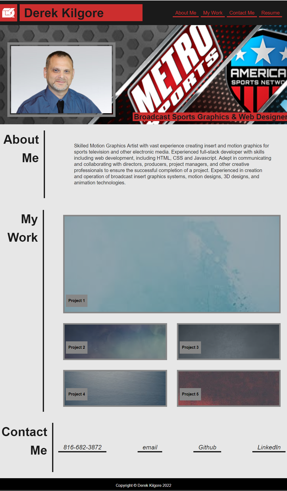
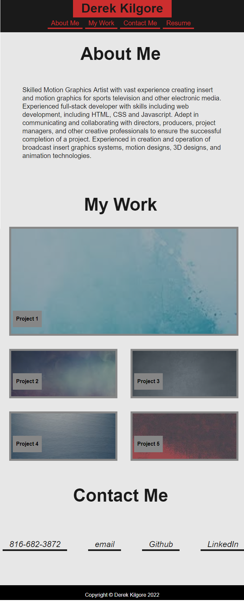
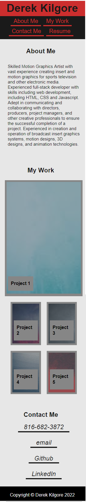

Project #2: Custom CSS and Media Queries Responsive Portfolio

### Description
Personal portfolio page design built with HTML / Responsive CSS framework. Created to showcase my  portfolio projects I am working on during the bootcamp, as well as my contact information and downloadable resume.

## Tasks completed
    -Has a Menu with About Me, Resume, Contact Me, and Work
    -UI scrolls to the selected sections
    -Links to first completed assignment
    -Responsive design made for 1200px, 768px, 320px sizes
    -Most link are dummies for now till my portfolio starts to grow
    
    
## Links

github account https://github.com/DKILGORE79/Kilgore-Portfolio

https://dkilgore79.github.io/Kilgore-Portfolio/

### Built with:

HTML5 and custom CSS3 with Media Queries

## Installation

not applicable

## Usage

Once deployed the application can be viewed in a traditional desktop web browser, tablet or mobile device.

## 1200px
 
## 768px

## 320px

## Credits

tutorials and recourses used
 - https://www.w3schools.com
 - https://developer.mozilla.org/en-US/docs/Web/HTML
 - https://coding-boot-camp.github.io/full-stack/github/professional-readme-guide
 - https://blog.hubspot.com/marketing/jump-link-same-page
 - https://www.youtube.com/kepowob
 - https://www.seancdavis.com/posts/three-ways-to-add-image-to-github-readme/  

## License

MIT License

Copyright (c) [2022] [Derek Kilgore]

Permission is hereby granted, free of charge, to any person obtaining a copy
of this software and associated documentation files (the "Software"), to deal
in the Software without restriction, including without limitation the rights
to use, copy, modify, merge, publish, distribute, sublicense, and/or sell
copies of the Software, and to permit persons to whom the Software is
furnished to do so, subject to the following conditions:

The above copyright notice and this permission notice shall be included in all
copies or substantial portions of the Software.

THE SOFTWARE IS PROVIDED "AS IS", WITHOUT WARRANTY OF ANY KIND, EXPRESS OR
IMPLIED, INCLUDING BUT NOT LIMITED TO THE WARRANTIES OF MERCHANTABILITY,
FITNESS FOR A PARTICULAR PURPOSE AND NONINFRINGEMENT. IN NO EVENT SHALL THE
AUTHORS OR COPYRIGHT HOLDERS BE LIABLE FOR ANY CLAIM, DAMAGES OR OTHER
LIABILITY, WHETHER IN AN ACTION OF CONTRACT, TORT OR OTHERWISE, ARISING FROM,
OUT OF OR IN CONNECTION WITH THE SOFTWARE OR THE USE OR OTHER DEALINGS IN THE
SOFTWARE.

---

